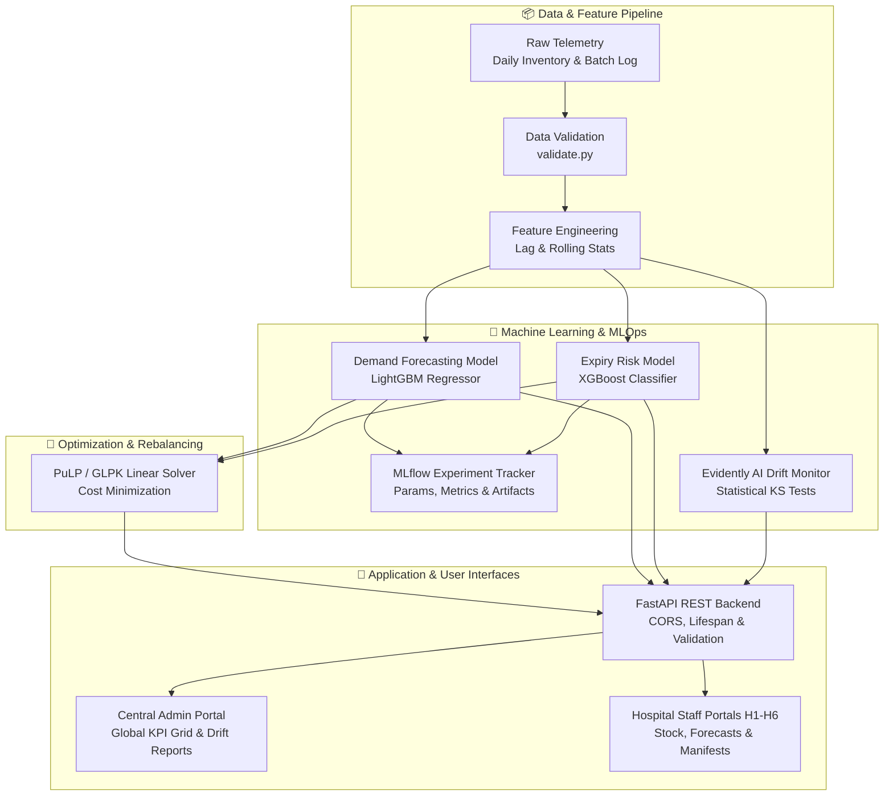

# VITALS: Verifiable Inventory Tracking & Allocation Logistics System

An end-to-end **Machine Learning Operations (MLOps)** and supply chain optimization platform designed to forecast blood demand across hospital networks, prevent critical shortages, eliminate shelf-life expiry waste, and automate inter-hospital transshipments.

---

## Key Highlights & Capabilities

* **Multi-Role Hospital Operations Portals**: Dedicated portals for **Central Network Command** (global health overview, transfer schedules, drift analytics) and **Individual Hospitals (`H1` to `H6`)** (local on-hand stock, Days-of-Supply progress indicators, local intake loggers).
* **Machine Learning Demand Forecasting**: Multi-horizon **LightGBM Regressor** with lag variables and calendar features benchmarked against a **Facebook Prophet** baseline.
* **Batch Expiry & Wastage Risk Classification**: Imbalanced-class **XGBoost Classifier** scoring shelf-life risk (%) to enforce proactive First-Expired-First-Out (FEFO) dispensing.
* **Linear Programming Optimization Engine**: Formulated with **PuLP / GLPK** to minimize network shortage penalties, transfer costs, and target collection drive expenses.
* **Automated Drift & Data Quality Monitoring**: Powered by **Evidently AI**, tracking statistical distribution drift (Kolmogorov-Smirnov tests) and rendering interactive HTML audit reports.
* **Real-Time Inventory Intake & Global State Sync**: Log daily units collected/issued with immediate multi-hospital and central admin synchronization.
* **Fully Containerized**: Ready for production deployment with Docker Compose.

---

## System Architecture


---

## Project Repository Structure

```
blood_bank_mlops/
├── backend/                       # Python FastAPI & MLOps Engine
│   ├── api/                       # REST API (routes, CORS middleware, lifespan)
│   │   └── app.py
│   ├── src/                       # Core ML Algorithms
│   │   ├── data_sim/              # Synthetic seed generator (H1–H6, 8 blood types)
│   │   ├── data_validation/       # Constraint & conservation law validation
│   │   ├── features/              # Feature engineering (lags, rolling averages)
│   │   ├── models/                # LightGBM Forecaster & XGBoost Expiry Classifier
│   │   └── optimization/          # PuLP / GLPK LP Rebalancing Solver
│   ├── monitoring/                # Evidently AI Drift Detection & Reports
│   │   ├── drift_monitor.py       # Generates HTML drift audits & metrics JSON
│   │   └── reports/               # data_drift_report.html & drift_metrics.json
│   ├── pipelines/                 # DVC & Python Pipeline Automation Orchestrators
│   │   ├── run_pipeline.py        # End-to-end pipeline execution runner
│   │   └── dvc.yaml               # DVC multi-stage pipeline definition
│   ├── data/                      # Raw & Processed Datasets (Git-ignored)
│   ├── models/                    # Serialized .pkl Model Artifacts (Git-ignored)
│   ├── notebooks/                 # Exploratory Data Analysis (EDA) Notebooks
│   ├── mlruns/ & mlflow.db        # MLflow Tracking Metadata & Artifacts (Git-ignored)
│   ├── tests/                     # Pytest Unit & Integration Test Suite (9 passing tests)
│   ├── requirements.txt           # Python Dependencies
│   ├── .env.example               # Backend Environment Template
│   └── Dockerfile                 # Backend Container Definition
│
├── frontend/                      # React 18 + Vite Web Application
│   ├── src/
│   │   ├── components/            # Navbar, LoginModal, AdminDashboard, HospitalDashboard, MonitoringTab
│   │   ├── services/              # API Integration Layer (Fetch API Client)
│   │   │   └── api.js
│   │   ├── App.jsx                # Root Application State & View Router
│   │   └── index.css              # Custom Glassmorphic CSS Design System
│   ├── dist/                      # Production Build Artifacts (Git-ignored)
│   ├── package.json               # Node Dependencies (lucide-react, chart.js, react-chartjs-2)
│   ├── .env.example               # Frontend Environment Template
│   └── Dockerfile                 # Frontend Multi-stage Nginx Container
│
├── .env.example                   # Master Environment Configuration Template
├── .env                           # Local Environment File (Git-ignored)
├── .gitignore                     # Git Exclusion Rules
├── docker-compose.yml             # Full-stack Multi-Container Deployment
└── README.md                      # Project Documentation
```

---

## Technology Stack

| Layer | Technologies |
| :--- | :--- |
| **Frontend** | React 18, Vite, Chart.js, React-Chartjs-2, Lucide Icons, Vanilla CSS Design System |
| **Backend & API** | FastAPI, Uvicorn, Pydantic, Starlette, Requests |
| **Machine Learning** | LightGBM, XGBoost, Facebook Prophet, Scikit-Learn, Pandas, NumPy |
| **Optimization** | PuLP, GLPK Linear Programming Solver |
| **MLOps & Tracking** | MLflow, Evidently AI, DVC (Data Version Control) |
| **Testing** | Pytest, FastAPI TestClient, Httpx |
| **Deployment** | Docker, Docker Compose, Nginx Alpine |

---

## Getting Started (Local Setup)

### Step 1: Clone the Repository & Configure Environment
```bash
git clone https://github.com/ananyaibhan/VITALS.git
cd VITALS

# Create your local .env file from template
cp .env.example .env
```

---

### Step 2: Backend Setup & ML Pipeline
```bash
# 1. Create and activate virtual environment
python3 -m venv venv
source venv/bin/activate

# 2. Install backend dependencies
cd backend
pip install -r requirements.txt

# 3. Run the full automated MLOps pipeline
# (Generates seed data, validates constraints, builds features, trains models, & computes drift)
python3 pipelines/run_pipeline.py

# 4. Start the FastAPI backend server
uvicorn api.app:app --port 8000 --reload
```
* **Interactive Swagger Docs**: [http://127.0.0.1:8000/docs](http://127.0.0.1:8000/docs)
* **Backend Health Check**: [http://127.0.0.1:8000/health](http://127.0.0.1:8000/health)

---

### Step 3: Frontend Setup (React + Vite)
In a new terminal window:
```bash
cd frontend
npm install
npm run dev
```
* **Live React Dashboard**: [http://localhost:5173](http://localhost:5173)

---

## Docker Deployment (Single Command)

Run the full stack containerized with health checks and volume mounts:
```bash
docker compose up --build
```
* **Frontend Web Application**: [http://localhost:3000](http://localhost:3000)
* **Backend API**: [http://localhost:8000](http://localhost:8000)

---

## REST API Reference

| Method | Endpoint | Description |
| :--- | :--- | :--- |
| `GET` | `/health` | Health check & loaded model confirmation |
| `GET` | `/network-summary` | Aggregated network units, critical status tags & facility breakdown |
| `GET` | `/hospital-inventory?hospital_id=H1` | On-hand blood stock, daily usage, and Days of Supply by blood group |
| `GET` | `/forecast?hospital_id=H1&blood_type=O+` | Next-day and 7-day predicted consumption with daily breakdown |
| `GET` | `/expiry-risk?hospital_id=H1` | Active batches scored with ML waste risk probability (%) and expiry countdown |
| `GET` | `/recommendation?hospital_id=H1` | Actionable PuLP rebalancing transfers and target collection drives |
| `POST` | `/log-intake` | Logs daily intake/dispensing and updates inventory & batch records in real time |
| `GET` | `/monitoring/drift-status` | Returns latest Evidently AI feature drift statistical metrics (JSON) |
| `GET` | `/monitoring/drift-report` | Serves the interactive Evidently AI HTML data drift report |

---

# 🩸 VITALS: Verifiable Inventory Tracking & Allocation Logistics System

An end-to-end **Machine Learning Operations (MLOps)** and supply chain optimization platform designed to forecast blood demand across hospital networks, prevent critical shortages, eliminate shelf-life expiry waste, and automate inter-hospital transshipments.

---

## 🌟 Key Highlights & Capabilities

* 🌐 **Multi-Role Hospital Operations Portals**: Dedicated portals for **Central Network Command** (global health overview, transfer schedules, drift analytics) and **Individual Hospitals (`H1` to `H6`)** (local on-hand stock, Days-of-Supply progress indicators, local intake loggers).
* 📈 **Machine Learning Demand Forecasting**: Multi-horizon **LightGBM Regressor** with lag variables and calendar features benchmarked against a **Facebook Prophet** baseline.
* ⚠️ **Batch Expiry & Wastage Risk Classification**: Imbalanced-class **XGBoost Classifier** scoring shelf-life risk (%) to enforce proactive First-Expired-First-Out (FEFO) dispensing.
* 🚚 **Linear Programming Optimization Engine**: Formulated with **PuLP / GLPK** to minimize network shortage penalties, transfer costs, and target collection drive expenses.
* 📊 **Automated Drift & Data Quality Monitoring**: Powered by **Evidently AI**, tracking statistical distribution drift (Kolmogorov-Smirnov tests) and rendering interactive HTML audit reports.
* 🔄 **Real-Time Inventory Intake & Global State Sync**: Log daily units collected/issued with immediate multi-hospital and central admin synchronization.
* 🐳 **Fully Containerized**: Ready for production deployment with Docker Compose.

---

## 🏗️ System Architecture



---

## 🗂️ Project Repository Structure

```
blood_bank_mlops/
├── backend/                       # 🐍 Python FastAPI & MLOps Engine
│   ├── api/                       # REST API (routes, CORS middleware, lifespan)
│   │   └── app.py
│   ├── src/                       # Core ML Algorithms
│   │   ├── data_sim/              # Synthetic seed generator (H1–H6, 8 blood types)
│   │   ├── data_validation/       # Constraint & conservation law validation
│   │   ├── features/              # Feature engineering (lags, rolling averages)
│   │   ├── models/                # LightGBM Forecaster & XGBoost Expiry Classifier
│   │   └── optimization/          # PuLP / GLPK LP Rebalancing Solver
│   ├── monitoring/                # 📊 Evidently AI Drift Detection & Reports
│   │   ├── drift_monitor.py       # Generates HTML drift audits & metrics JSON
│   │   └── reports/               # data_drift_report.html & drift_metrics.json
│   ├── pipelines/                 # 🔄 DVC & Python Pipeline Automation Orchestrators
│   │   ├── run_pipeline.py        # End-to-end pipeline execution runner
│   │   └── dvc.yaml               # DVC multi-stage pipeline definition
│   ├── data/                      # Raw & Processed Datasets (Git-ignored)
│   ├── models/                    # Serialized .pkl Model Artifacts (Git-ignored)
│   ├── notebooks/                 # Exploratory Data Analysis (EDA) Notebooks
│   ├── mlruns/ & mlflow.db        # MLflow Tracking Metadata & Artifacts (Git-ignored)
│   ├── tests/                     # Pytest Unit & Integration Test Suite (9 passing tests)
│   ├── requirements.txt           # Python Dependencies
│   ├── .env.example               # Backend Environment Template
│   └── Dockerfile                 # Backend Container Definition
│
├── frontend/                      # ⚛️ React 18 + Vite Web Application
│   ├── src/
│   │   ├── components/            # Navbar, LoginModal, AdminDashboard, HospitalDashboard, MonitoringTab
│   │   ├── services/              # API Integration Layer (Fetch API Client)
│   │   │   └── api.js
│   │   ├── App.jsx                # Root Application State & View Router
│   │   └── index.css              # Custom Glassmorphic CSS Design System
│   ├── dist/                      # Production Build Artifacts (Git-ignored)
│   ├── package.json               # Node Dependencies (lucide-react, chart.js, react-chartjs-2)
│   ├── .env.example               # Frontend Environment Template
│   └── Dockerfile                 # Frontend Multi-stage Nginx Container
│
├── .env.example                   # Master Environment Configuration Template
├── .env                           # Local Environment File (Git-ignored)
├── .gitignore                     # Git Exclusion Rules
├── docker-compose.yml             # Full-stack Multi-Container Deployment
└── README.md                      # Project Documentation
```

---

## 🛠️ Technology Stack

| Layer | Technologies |
| :--- | :--- |
| **Frontend** | React 18, Vite, Chart.js, React-Chartjs-2, Lucide Icons, Vanilla CSS Design System |
| **Backend & API** | FastAPI, Uvicorn, Pydantic, Starlette, Requests |
| **Machine Learning** | LightGBM, XGBoost, Facebook Prophet, Scikit-Learn, Pandas, NumPy |
| **Optimization** | PuLP, GLPK Linear Programming Solver |
| **MLOps & Tracking** | MLflow, Evidently AI, DVC (Data Version Control) |
| **Testing** | Pytest, FastAPI TestClient, Httpx |
| **Deployment** | Docker, Docker Compose, Nginx Alpine |

---

## 🚀 Getting Started (Local Setup)

### Prerequisites
* **Python**: `3.11+`
* **Node.js**: `v18+` (or `v20+`)
* **Homebrew (macOS)**: `brew install libomp glpk`

---

### Step 1: Clone the Repository & Configure Environment
```bash
git clone https://github.com/ananyaibhan/VITALS.git
cd VITALS

# Create your local .env file from template
cp .env.example .env
```

---

### Step 2: Backend Setup & ML Pipeline
```bash
# 1. Create and activate virtual environment
python3 -m venv venv
source venv/bin/activate

# 2. Install backend dependencies
cd backend
pip install -r requirements.txt

# 3. Run the full automated MLOps pipeline
# (Generates seed data, validates constraints, builds features, trains models, & computes drift)
python3 pipelines/run_pipeline.py

# 4. Start the FastAPI backend server
uvicorn api.app:app --port 8000 --reload
```
* **Interactive Swagger Docs**: [http://127.0.0.1:8000/docs](http://127.0.0.1:8000/docs)
* **Backend Health Check**: [http://127.0.0.1:8000/health](http://127.0.0.1:8000/health)

---

### Step 3: Frontend Setup (React + Vite)
In a new terminal window:
```bash
cd frontend
npm install
npm run dev
```
* **Live React Dashboard**: [http://localhost:5173](http://localhost:5173)

---

## 🐳 Docker Deployment (Single Command)

Run the full stack containerized with health checks and volume mounts:
```bash
docker compose up --build
```
* **Frontend Web Application**: [http://localhost:3000](http://localhost:3000)
* **Backend API**: [http://localhost:8000](http://localhost:8000)

---

## 📡 REST API Reference

| Method | Endpoint | Description |
| :--- | :--- | :--- |
| `GET` | `/health` | Health check & loaded model confirmation |
| `GET` | `/network-summary` | Aggregated network units, critical status tags & facility breakdown |
| `GET` | `/hospital-inventory?hospital_id=H1` | On-hand blood stock, daily usage, and Days of Supply by blood group |
| `GET` | `/forecast?hospital_id=H1&blood_type=O+` | Next-day and 7-day predicted consumption with daily breakdown |
| `GET` | `/expiry-risk?hospital_id=H1` | Active batches scored with ML waste risk probability (%) and expiry countdown |
| `GET` | `/recommendation?hospital_id=H1` | Actionable PuLP rebalancing transfers and target collection drives |
| `POST` | `/log-intake` | Logs daily intake/dispensing and updates inventory & batch records in real time |
| `GET` | `/monitoring/drift-status` | Returns latest Evidently AI feature drift statistical metrics (JSON) |
| `GET` | `/monitoring/drift-report` | Serves the interactive Evidently AI HTML data drift report |

---

## 🧪 Automated Testing Suite

The project includes unit and integration tests covering data integrity rules, balance conservation laws, and all API routes:

```bash
cd backend
source ../venv/bin/activate
pytest tests/
```

---

## 🔒 Security & Version Control Policy

* **No Secrets Committed**: All private API keys, ports, and environment variables are managed through `.env` files which are strictly excluded via `.gitignore`.
* **No Large Artifacts in Git**: Models (`*.pkl`, `*.joblib`, `*.skops`, `*.ubj`) and CSV datasets are excluded from git.
* **Reproducible**: Running `python3 pipelines/run_pipeline.py` regenerates all verified datasets and model artifacts locally on clean clones.

---
